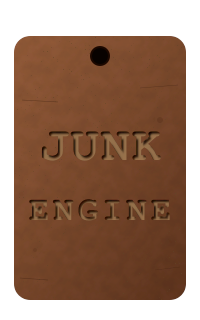

<a name="readme-top"></a>

[![MIT License][license-shield]][license-url]

<br />
<div align="center">
  <a href="https://github.com/mindmatrix/junk-engine">
    
  </a>

  <h3 align="center">JunkEngine</h3>

  <p align="center">
    A scrappy, hacky game engine that gets the job done (mostly).
  </p>
</div>

## Table of Contents

- [About](#about)
- [Rendering Engines](#rendering-engines)
  - [Turbo (WebGPU)](#turbo-webgpu)
  - [Crank (CPU Software)](#crank-cpu-software)
- [Shading Modes](#shading-modes)
- [Scene Management](#scene-management)
- [Importers and Exporters](#importers-and-exporters)
- [Getting Started](#getting-started)
  - [Prerequisites](#prerequisites)
  - [Installation](#installation)
  - [Running](#running)
- [Usage](#usage)
- [Project Structure](#project-structure)
- [License](#license)

## About

JunkEngine is a TypeScript-based rendering engine that supports both hardware-accelerated WebGPU rendering and pure CPU software rasterization. It provides a unified scene graph, PBR and toon shading, glTF/OBJ import and export, and first-person camera controls.

### Built With

- TypeScript
- WebGPU (WGSL shaders)
- Webpack

## Rendering Engines

JunkEngine ships with two renderers that share the same `Scene` interface.

### Turbo (WebGPU)

Hardware-accelerated renderer using the WebGPU API. Features:

- PBR shading: multi-light diffuse, Blinn-Phong specular, Fresnel F0, metallic-roughness workflow
- Toon/cel shading: quantized diffuse bands, hard specular, rim lighting, screen-space edge detection
- Post-process outline pass (toon mode): Sobel + Roberts cross depth-edge detection rendered as a fullscreen triangle
- Normal mapping with tangent-space TBN reconstruction from screen derivatives
- Alpha mask and alpha blend pipelines
- Frustum culling via bounding sphere tests

```typescript
import { TurboRenderer } from "@/engine/renderers";

const renderer = await TurboRenderer.create(canvas);
renderer.render(scene);
```

### Crank (CPU Software)

Pure CPU software renderer that rasterizes directly into an `ImageData` pixel buffer. Useful for environments without WebGPU support or for debugging. Features:

- Scanline triangle rasterization with perspective-correct barycentric interpolation
- Two depth-testing strategies: per-pixel z-buffer (default) or painter's algorithm (back-to-front sort)
- PBR shading: same lighting model as Turbo (diffuse, Blinn-Phong specular, Fresnel, metallic-roughness)
- Normal mapping with per-triangle TBN
- Texture sampling and alpha mask support

```typescript
import { CrankRenderer } from "@/engine/renderers";

const ctx = canvas.getContext("2d")!;
const renderer = new CrankRenderer(canvas, ctx);
renderer.depthMode = "zbuffer"; // or "painter"
renderer.render(scene);
```

## Shading Modes

The `Scene.shadingMode` property controls how the Turbo renderer shades geometry. Set it before or during the render loop -- it takes effect on the next frame.

| Mode              | Value | Description                                                                                   |
|-------------------|-------|-----------------------------------------------------------------------------------------------|
| `ShadingMode.PBR` | 0     | Physically-based rendering with smooth diffuse, specular, metallic-roughness, and Fresnel.    |
| `ShadingMode.Toon`| 1     | Cel shading with quantized light bands, hard specular, rim lighting, and post-process outlines.|

```typescript
import { Scene, ShadingMode } from "@/engine";

const scene = new Scene("MyScene");
scene.shadingMode = ShadingMode.Toon;
```

The toon shader respects material properties:

- Metallic surfaces receive reduced diffuse and stronger specular highlights.
- Rough surfaces suppress specular and rim effects.
- Post-process outlines use depth-buffer edge detection (Sobel + Roberts cross) with depth-adaptive thresholds.


## Scene Management

A `Scene` holds all renderable entities, materials, lights, and the active camera.

```typescript
import { Scene, createDirectionalLight, createPointLight } from "@/engine";

const scene = new Scene("MyScene");

// Camera
scene.camera.position = new Float32Array([0, 2, 5]);
scene.camera.target = new Float32Array([0, 0, 0]);
scene.camera.fov = Math.PI / 4;

// Lights
scene.addLight(createDirectionalLight([-0.6, -0.7, 0.4], {
    intensity: 0.6,
    color: [1, 0.98, 0.95],
}));
scene.addLight(createPointLight([0, 3, 0], {
    intensity: 2,
    attenuation: { constant: 1, linear: 0.09, quadratic: 0.032 },
}));

// Materials
const matId = scene.addMaterial({
    baseColor: new Float32Array([0.8, 0.2, 0.2, 1.0]),
    diffuseTexture: null,
    metallicRoughnessTexture: null,
    metallicFactor: 0,
    roughnessFactor: 0.8,
    alphaMode: "OPAQUE",
    alphaCutoff: 0.5,
    normalTexture: null,
    normalScale: 1,
});

// Objects
scene.addObject({
    name: "my-mesh",
    mesh: meshData,
    transform: identityMatrix,
    materialId: matId,
    dirty: 0b111,
});
```

First-person camera controls are available via `rotateCamera`:

```typescript
import { rotateCamera } from "@/engine";

document.addEventListener("mousemove", (e) => {
    rotateCamera(scene.camera, -e.movementX * 0.002, e.movementY * 0.002);
});
```


## Importers and Exporters

| Format     | Import | Export | Notes                                                        |
|------------|--------|--------|--------------------------------------------------------------|
| glTF / GLB | Yes    | Yes    | Meshes, materials, PBR textures, node transforms, alpha modes|
| OBJ        | Yes    | Yes    | Positions, normals, UVs, basic materials                     |
| JunkScene  | Yes    | Yes    | Native binary scene format                                   |

```typescript
import { GltfImporter } from "@/engine";

const response = await fetch("models/scene.glb");
const glb = await response.arrayBuffer();
const importedScene = await new GltfImporter().importAsync(glb);

for (const obj of importedScene.getObjects()) {
    // Add objects to your scene...
}
```

## Getting Started

### Prerequisites

- Node.js >= 20
- A browser with WebGPU support (Chrome 113+, Edge 113+, or Firefox Nightly) for the Turbo renderer
- Any modern browser for the Crank (CPU) renderer

### Installation

```sh
git clone https://github.com/mindmatrix/junk-engine.git
cd junk-engine
npm install
```

### Running

Start the development server with hot reload:

```sh
npm start
```

Build for production:

```sh
npm run build
```

Other commands:

```sh
npm run dev       # Development build (no server)
npm run lint      # Run ESLint
npm run lint:fix  # Auto-fix lint issues
npm run clean     # Remove dist/
```

## Usage

The default entry point (`src/index.ts`) launches a demo scene on a canvas element with id `canvas`:

```typescript
import { Scene, ShadingMode, GltfImporter, TurboRenderer, createDirectionalLight } from "@/engine";

const scene = new Scene("Demo");
scene.shadingMode = ShadingMode.Toon;
scene.addLight(createDirectionalLight([-0.6, -0.7, 0.4], { intensity: 0.6 }));

const renderer = await TurboRenderer.create(canvas);

const glb = await (await fetch("models/my_model.glb")).arrayBuffer();
const imported = await new GltfImporter().importAsync(glb);
for (const obj of imported.getObjects()) {
    const mat = imported.getMaterial(obj.materialId);
    const matId = scene.addMaterial({ /* ... */ });
    scene.addObject({ name: obj.name, mesh: obj.mesh, transform: obj.transform, materialId: matId, dirty: 0b111 });
}

function loop() {
    renderer.render(scene);
    requestAnimationFrame(loop);
}
requestAnimationFrame(loop);
```


## Project Structure

```
src/
  engine/
    models/          Scene, Camera, SceneObject, Material, LightSource, Renderer
    renderers/
      turbo/         WebGPU renderer, WGSL shaders (vertex, fragment, outline), pipeline
      crank/         CPU software renderer
    importers/       GltfImporter, ObjImporter, JunkSceneImporter
    exporters/       GltfExporter, ObjExporter, JunkSceneExporter
    utilities/       Math helpers, glTF types, render utilities
  examples/
    scenes/          Demo scenes
```

## License

Distributed under the MIT License. See `LICENSE.txt` for more information.

<!-- MARKDOWN LINKS -->
[license-shield]: https://img.shields.io/github/license/mind-matrix/JunkEngine?style=for-the-badge
[license-url]: https://github.com/mind-matrix/JunkEngine/blob/master/LICENSE.txt
